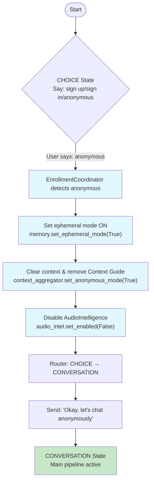
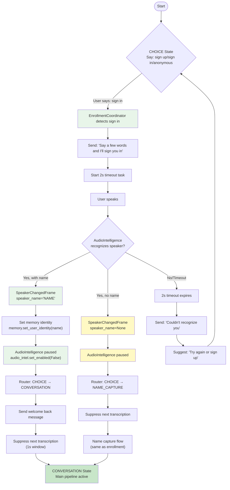

# Enrollment Flow Diagram - LocalCat Voice Assistant

## Flow States

| State | Description | Pipeline Used |
|-------|-------------|---------------|
| `CHOICE` | Initial prompt offering sign up/sign in/anonymous options | Intro Pipeline |
| `INTRO` | Welcome message and enrollment instructions | Intro Pipeline |
| `ENROLLING` | Collecting voice samples (1/3, 2/3, 3/3) | Intro Pipeline |
| `TRANSITION` | "Perfect! I've enrolled your voice" acknowledgment | Intro Pipeline |
| `NAME_CAPTURE` | Asking for user's preferred name/ID | Intro Pipeline |
| `CONVERSATION` | Main chat mode | Conversation Pipeline |

## Three Primary Flows

### 1. Anonymous Mode Flow
User chooses to chat without storing anything

**Key Components:**
- **EnrollmentCoordinator** (enrollment_coordinator.py:536-566)
  - Handles "anonymous" keyword detection
  - Sets ephemeral mode in memory processor
  - Enables anonymous mode in context aggregator
  - Disables audio intelligence for privacy
- **AnonymousAwareContextAggregator** (anonymous_context.py:69-136)
  - Clears conversation history
  - Removes Context Guide system message
  - Rebuilds system prompt without memory section
  - Adds "Anonymous session" marker
- **Memory Processor**
  - Ephemeral mode prevents storage/extraction

### 2. New User Enrollment Flow
User chooses to create a new voice profile

```mermaid
graph TD
    Start([Start]) --> Choice{CHOICE State<br/>Say: sign up/sign in/anonymous}

    Choice -->|"User says: sign me up"| Enroll1[EnrollmentCoordinator detects sign up]
    Enroll1 --> Enroll2[Router: CHOICE → INTRO]
    Enroll2 --> Enroll3[Send intro message + instructions<br/>'Please repeat: LocalCat learns my voice']
    Enroll3 --> Enroll4[User starts speaking]
    Enroll4 --> Enroll5[AudioIntelligence detects unknown speaker]
    Enroll5 --> Enroll6[Router: INTRO → ENROLLING]
    Enroll6 --> Enroll7[Collect sample 1/3]
    Enroll7 --> Enroll8[Send: 'Got it #40;1/3#41;']
    Enroll8 --> Enroll9[Collect sample 2/3]
    Enroll9 --> Enroll10[Send: 'Nice #40;2/3#41;']
    Enroll10 --> Enroll11[Collect sample 3/3]
    Enroll11 --> Enroll12[AudioIntelligence: SpeakerChangedFrame<br/>auto_enrolled=True]
    Enroll12 --> Enroll13[Router: ENROLLING → TRANSITION]
    Enroll13 --> Enroll14[Send: 'Perfect! I've enrolled your voice']
    Enroll14 --> Enroll15[Router: TRANSITION → NAME_CAPTURE]
    Enroll15 --> Enroll16[AudioIntelligence paused<br/>audio_intel.set_enabled#40;False#41;]
    Enroll16 --> NameCapture{Ask for name/ID}

    NameCapture --> Validate1[User says name]
    Validate1 --> Validate2{Validate name<br/>1-3 words, ≤20 chars}
    Validate2 -->|Invalid| Validate3[Send: 'I didn't catch a valid name']
    Validate3 --> NameCapture
    Validate2 -->|Valid| Confirm1[Send: 'Did I get that right: NAME?']
    Confirm1 --> Confirm2{User confirms}
    Confirm2 -->|"No"| Confirm3[Send: 'What name should I use?']
    Confirm3 --> NameCapture
    Confirm2 -->|"Yes"| Save1[Save name to profile<br/>audio_intel.set_speaker_name#40;#41;]
    Save1 --> Save2[Set memory identity<br/>memory.set_user_identity#40;name#41;]
    Save2 --> Enroll17[Send: 'Thanks, NAME']
    Enroll17 --> Enroll18[Router: NAME_CAPTURE → CONVERSATION]
    Enroll18 --> Conversation[CONVERSATION State<br/>Main pipeline active]

    style Enroll1 fill:#fff3e0
    style Enroll6 fill:#fff3e0
    style Enroll12 fill:#fff3e0
    style Enroll15 fill:#fff3e0
    style Enroll16 fill:#ffe0b2
    style Save1 fill:#fff3e0
    style Conversation fill:#c8e6c9
```

**Key Components:**
- **AudioIntelligenceProcessor**
  - Emits `UnknownSpeakerDetectedFrame` on first utterance
  - Collects voice samples (default: 3)
  - Emits `EnrollmentProgressFrame` for each sample
  - Emits `SpeakerChangedFrame` when enrollment completes
  - Gets paused after enrollment (privacy/performance)
- **EnrollmentCoordinator** (enrollment_coordinator.py:415-448)
  - Orchestrates the entire enrollment flow
  - Handles name capture with validation
  - Name validation: 1-3 words, ≤20 chars, not similar to fixed phrase
- **SpeakerEnrollmentRouter** (pipeline_router.py)
  - Routes frames between intro and conversation pipelines
  - Uses `ParallelPipeline` with filter functions

### 3. Returning User Sign-In Flow
User has an existing profile and wants to be recognized

**Key Components:**
- **AudioIntelligenceProcessor**
  - Attempts to match voice against existing profiles
  - Returns `SpeakerChangedFrame` with speaker_id and optional speaker_name
  - Gets paused after successful recognition
- **EnrollmentCoordinator** (enrollment_coordinator.py:450-497)
  - Handles returning user with/without name
  - Suppresses next transcription frame (prevents overlap)
  - Sets memory user identity when name is known
- **Transcription Suppression**
  - Critical: The utterance that triggered recognition is still in pipeline
  - Without suppression, it would be incorrectly interpreted as name attempt

## Critical Implementation Details

### 1. Pipeline Architecture
- Uses **ParallelPipeline** with two branches:
  - **Intro Pipeline**: Direct TTS feedback, bypasses LLM
  - **Conversation Pipeline**: Full LLM processing with memory
- Router uses filter functions to direct frames

### 2. State Transitions
- **EnrollmentCoordinator** orchestrates all state changes
- **SpeakerEnrollmentRouter** maintains current state with async lock
- State changes trigger pipeline routing updates

### 3. Memory & Context Management
- **Anonymous Mode**:
  - `ephemeral_mode=True` prevents memory storage
  - Context history cleared
  - System prompt rebuilt without memory section
- **Enrolled/Signed-In Users**:
  - Memory active with user identity
  - Full context history maintained
  - System prompt includes memory capabilities

### 4. Audio Intelligence Lifecycle
- **Active** during:
  - Initial CHOICE state
  - Enrollment sample collection
- **Paused** after:
  - Successful enrollment completion
  - Successful user recognition
  - Anonymous mode selection
- **Re-enabled** on:
  - User says "logout" in conversation

### 5. TTS Configuration Differences
- **Intro Pipeline TTS**: `use_boundaries=False`
  - Full messages play as single unit
  - No sentence splitting
- **Conversation Pipeline TTS**: `use_boundaries=True`
  - Intelligent sentence boundaries
  - Natural speech flow

### 6. Mic Muting Strategy
- Uses `STTMuteFilter` during CHOICE state
- Only mutes while TTS is playing enrollment prompts
- Prevents echo/loopback triggering false interruptions

## File Locations

| Component | File | Key Lines |
|-----------|------|-----------|
| EnrollmentCoordinator | `core/audio/enrollment_coordinator.py` | 30-692 |
| SpeakerEnrollmentRouter | `core/audio/pipeline_router.py` | 30-200 |
| AnonymousAwareContextAggregator | `core/memory/anonymous_context.py` | 10-234 |
| VoiceAgentFactory | `core/factory.py` | 155-473 |
| EnrollmentState | `core/audio/enrollment_state.py` | 13-24 |

## Environment Variables

| Variable | Default | Description |
|----------|---------|-------------|
| `ENABLE_INTRO_PIPELINE` | `true` | Enable enrollment UX |
| `ENABLE_EPHEMERAL_CHOICE` | `true` | Show initial choice prompt |
| `ENROLLMENT_FIXED_PHRASE` | `LocalCat learns my voice` | Phrase for enrollment |
| `SIGN_ME_UP_TERMS` | `sign me up\|register me\|...` | Keywords for enrollment |
| `SIGN_IN_TERMS` | `sign in\|log in\|...` | Keywords for sign-in |
| `ANONYMOUS_TERMS` | `anonymous\|private\|...` | Keywords for anonymous |
| `SPEAKER_AUTO_ENROLL_UTTERANCES` | `3` | Samples needed for enrollment |

## Notes on Technical Debt

The current implementation has significant duplication between:
1. **Isolated worker patterns** (~800 lines duplicated)
2. **Event handlers** in factory.py (identical functions)
3. **Worker communication protocols** (~400 lines duplicated)

However, the core enrollment flow logic is well-structured with clear separation of concerns between:
- State management (EnrollmentState)
- Orchestration (EnrollmentCoordinator)
- Routing (SpeakerEnrollmentRouter)
- Context management (AnonymousAwareContextAggregator)